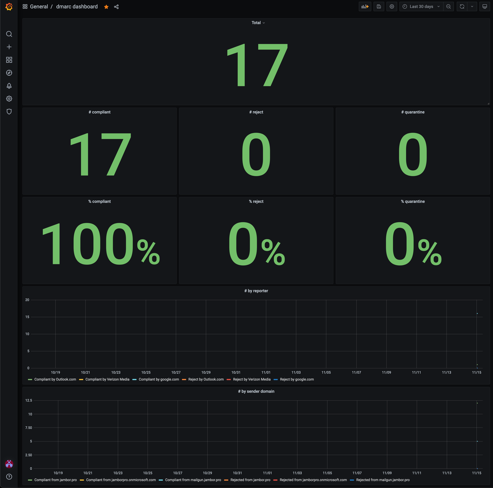

.. image:: https://github.com/jgosmann/dmarc-metrics-exporter/actions/workflows/ci.yml/badge.svg
  :target: https://github.com/jgosmann/dmarc-metrics-exporter/actions/workflows/ci.yml
  :alt: CI and release pipeline
.. image:: https://codecov.io/gh/jgosmann/dmarc-metrics-exporter/branch/main/graph/badge.svg?token=O4M05YWNQK
  :target: https://codecov.io/gh/jgosmann/dmarc-metrics-exporter
  :alt: Codecov coverage
.. image:: https://img.shields.io/pypi/v/dmarc-metrics-exporter
  :target: https://pypi.org/project/dmarc-metrics-exporter/
  :alt: PyPI
.. image:: https://img.shields.io/pypi/pyversions/dmarc-metrics-exporter
  :target: https://pypi.org/project/dmarc-metrics-exporter/
  :alt: PyPI - Python Version
.. image:: https://img.shields.io/pypi/l/dmarc-metrics-exporter
  :target: https://pypi.org/project/dmarc-metrics-exporter/
  :alt: PyPI - License

dmarcs-metrics-exporter
=======================

Export metrics derived from DMARC aggregate reports to Prometheus.
This exporter regularly polls
for new aggregate report emails
via IMAP.
The following metrics will be collected
and exposed at an HTTP endpoint
for Prometheus:

* ``dmarc_total``: Total number of reported messages.
* ``dmarc_compliant_total``: Total number of DMARC compliant messages.
* ``dmarc_quarantine_total``: Total number of quarantined messages.
* ``dmarc_reject_total``: Total number of rejected messages.
* ``dmarc_spf_aligned_total``: Total number of SPF algined messages.
* ``dmarc_spf_pass_total``: Total number of messages with raw SPF pass.
* ``dmarc_dkim_aligned_total``: Total number of DKIM algined messages.
* ``dmarc_dkim_pass_total``: Total number of messages with raw DKIM pass.

Each of these metrics is subdivided by the following labels:

* ``reporter``: Domain from which a DMARC aggregate report originated.
* ``from_domain``: Domain from which the evaluated email originated.
* ``dkim_domain``: Domain the DKIM signature is for.
* ``spf_domain``: Domain used for the SPF check.

In addition, there is a ``dmarc_invalid_reports_total`` metric with a count of
DMARC report emails from which no report could be parsed. It is subdivided by
a single ``from_email`` label.

Installation
------------

This describes the manual setup fo dmarc-metrics-exporter.
An Ansible role for automated deployment is provided in ``roles``.
Further instructions for Ansible are given in the readme file
provided in that directory.

It is best to run dmarc-metrics-exporter under a separate system user account.
Create one for example with

.. code-block:: bash

    adduser --system --group dmarc-metrics

Then you can install dmarc-metrics-exporter with ``pip`` from PyPI for that
user:

.. code-block:: bash

    sudo -u dmarc-metrics pip3 install dmarc-metrics-exporter

You will need a location to store the ``metrics.db`` that is writable by that
user, for example:

.. code-block:: bash

    mkdir /var/lib/dmarc-metrics-exporter
    chown dmarc-metrics:dmarc-metrics /var/lib/dmarc-metrics-exporter

Configuration
-------------

To run dmarc-metrics-exporter a configuration file in JSON format is required.
The default location is ``/etc/dmarc-metrics-exporter.json``.

Because the configuration file will contain the IMAP password,
make sure to ensure proper permissions on it,
for example:

.. code-block:: bash

    chown root:dmarc-metrics /etc/dmarc-metrics-exporter.json
    chmod 640 /etc/dmarc-metrics-exporter.json

An example configuration file is provided in this repository in
``config/dmarc-metrics-exporter.sample.json``.

The following configuration options are available:

* ``listen_addr`` (string, default ``"127.0.0.1"``): Listen address for the HTTP endpoint. Use ``"0.0.0.0"`` if running in a dockerized environment.
* ``port`` (number, default ``9797``): Port to listen on for the HTTP endpoint.
* ``imap`` (object, required): IMAP configuration to check for aggregate reports.

  * ``host`` (string, default ``"localhost"``): Hostname of IMAP server to connect to.
  * ``port`` (number, default ``993``): Port of the IMAP server to connect to.
  * ``username`` (string, required): Login username for the IMAP connection.
  * ``password``: (string, required): Login password for the IMAP connection.
  * ``use_ssl``: (boolean, default ``true``): Whether to use SSL encryption for the connection. Disabling this will transmit the password in clear text! Currently, there is no support for STARTTLS.
  * ``verify_certificate``: (boolean, default ``true``): Whether to verify the server's SSL certificate. You might have to set this to ``false`` if you are using a self-signed certificate. If this is disabled, someone else could impersonate the server and obtain the login data.

* ``folders`` (object):

  * ``inbox`` (string, default ``"INBOX"``): IMAP mailbox that is checked for incoming DMARC aggregate reports.
  * ``done`` (string, default ``"Archive"``): IMAP mailbox that successfully processed reports are moved to.
  * ``error``: (string, default ``"Invalid"``): IMAP mailbox that emails are moved to that could not be processed.

* ``storage_path`` (string, default ``"/var/lib/dmarc-metrics-exporter"``):
  Directory to persist data in that has to persisted between restarts.
* ``poll_interval_seconds`` (number, default ``60``): How often to poll the IMAP server in seconds.
* ``deduplication_max_seconds`` (number, default ``604800`` which is 7 days): How long individual report IDs will be remembered to avoid counting double delivered reports twice.
* ``logging`` (object, default ``{}``): Logging configuration, see the "Logging configuration" section below.

Logging configuration
^^^^^^^^^^^^^^^^^^^^^

When providing a custom logging configuration, it must follow the dictionary
schema (version 1) described in the `logging.config documentation <https://docs.python.org/3/library/logging.config.html#configuration-dictionary-schema>`_.
In general, a provided top-level key will replace the default configuration,
but there are some exceptions. The following keys are always fixed:

* ``version`` will always be ``1``.
* ``incremental`` will always be ``false``.
* ``formatters`` is fixed and provides the following formatters:

  * ``plain`` renders human-readable log messages without colors.
  * ``colored`` renders human-readable log messages with colors.
  * ``json`` renders structured JSON log messages.

In addition, the ``root`` key has some special handling. If it is overridden,
but not ``handlers`` key is provided, ``handlers: ['default']`` will be inserted
automatically. Also, the ``level`` key will be set to ``'DEBUG'`` if the
application is started with the ``--debug`` flag.

Configuring log level
"""""""""""""""""""""

To change the log level globally:

.. code-block:: json

    {
        "logging": {
            "root": {
                "level": "WARNING"
            }
        }
    }

Configuring logging format
""""""""""""""""""""""""""

To change the logging format:

.. code-block:: json

    {
        "logging": {
            "handlers": {
                "default": {
                    "class": "logging.StreamHandler",
                    "formatter": "json"
                }
            }
        }
    }

Valid formats are ``plain``, ``colored``, and ``json``.

Disabling Uvicorn access logs
"""""""""""""""""""""""""""""

To disable the Uvicorn access logs:

.. code-block:: json

    {
        "logging": {
            "loggers": {
                "uvicorn.access": {
                    "propagate": false
                }
            }
        }
    }

Usage
-----

To run dmarc-metrics-exporter with the default configuration in
``/etc/dmarc-metrics-exporter.json``:

.. code-block:: bash

    sudo -u dmarc-metrics python3 -m dmarc_metrics_exporter

To use a different configuration file:

.. code-block:: bash

    sudo -u dmarc-metrics python3 -m dmarc_metrics_exporter --configuration <path>

You can enable debug logging with the `--debug`
if you do not want to provide your own logging configuration:

.. code-block:: bash

    sudo -u dmarc-metrics python3 -m dmarc_metrics_exporter --debug

systemd
^^^^^^^

Instead of manually starting the dmarc-metrics-exporter,
you likely want to have it run as a system service.
An example systemd service file is provided in this repository in
``config/dmarc-metrics-exporter.service``.
Make sure that the paths and user/group names match your configuration
and copy it to ``/etc/systemd/system`` to use it.
To have systemd pick it up a ``systemctl daemon-reload`` might be necessary.

You can than start/stop dmarc-metrics-exorter with:

.. code-block:: bash

    systemctl start dmarc-metrics-exporter
    systemctl stop dmarc-metrics-exporter

To have dmarc-metrics-exporter start on system boot:

.. code-block:: bash

    systemctl enable dmarc-metrics-exporter

Docker
^^^^^^

A new docker image is build for each release
with GitHub Actions as described in this yaml-file:
``.github/workflows/docker-publish.yml``.

Note that you should configure the `listen_addr` to `0.0.0.0` to be able to
access the metrics exporter from outside the container.

Example docker-compose file:

.. code-block:: yml

    version: "3"

    services:

      dmarc-metrics-exporter:
        # source: https://github.com/jamborjan/dmarc-metrics-exporter/pkgs/container/dmarc-metrics-exporter
        container_name: dmarc-metrics-exporter
        hostname: dmarc-metrics-exporter
        image: jgosmann/dmarc-metrics-exporter:1.2.0
        restart: unless-stopped
        user: 1000:1000 #PUID=1000:PGID=1000
        expose:
          - 9797
        volumes:
          - '/host/folder/dmarc-metrics-exporter.json:/etc/dmarc-metrics-exporter.json'
          - '/host/folder/dmarc-metrics-exporter/metrics:/var/lib/dmarc-metrics-exporter:rw'
        logging:
          driver: "json-file"
          options:
            tag: "{{.ImageName}}|{{.Name}}|{{.ImageFullID}}|{{.FullID}}"
        networks:
          - YourDockerLan

    # $ docker network create -d bridge --attachable YourDockerLan
    networks:
      YourDockerLan:
        external:
          name: YourDockerLan

Prometheus
^^^^^^^^^^

Example prometheus config file:

.. code-block:: yml

    global:
      scrape_interval: 15s
      evaluation_interval: 15s

    rule_files:

    scrape_configs:

      - job_name: 'dmarc-metrics-exporter'
        static_configs:
          - targets: ['dmarc-metrics-exporter:9797']

Grafana
^^^^^^^

An example configuration file is provided in this repository in
``config/dmarc-metrics-exporter.grafana.sample.json``. This example dashboard displays the collected metrics as shown in the screenshot below.

   Example grafana dashboard

Hints
^^^^^

You should not use your normal email and password credentials for the dmarc-metrics-exporter.
If you are not able to create a dedicated service account email account, you should use an app password.

Microsoft Exchange Online
"""""""""""""""""""""""""

* App passwords are available when you are using Multi Factor Authentication (MFA).
  `Manage app passwords for two-step verification <https://account.activedirectory.windowsazure.com/AppPasswords.aspx>`_
* If you don't see the app passwords option or get an error,
  `check if MFA is enabled <https://account.activedirectory.windowsazure.com/UserManagement/MultifactorVerification.aspx>`_
  for the user.
* If you still don't see the app passwords option,
  `check if app passwords are allowed in your organization <https://docs.microsoft.com/en-us/azure/active-directory/authentication/howto-mfa-app-passwords#allow-users-to-create-app-passwords>`_
* Finally, `ensure that IMAP is enabled for the user <https://docs.microsoft.com/en-us/exchange/clients-and-mobile-in-exchange-online/pop3-and-imap4/enable-or-disable-pop3-or-imap4-access>`_.

Development
-----------

Prerequisites
^^^^^^^^^^^^^

* `Python <https://www.python.org/>`_
* `pre-commit <https://pre-commit.com/>`_
* `Poetry <https://python-poetry.org/>`_
* `Docker <https://www.docker.com/>`_

Setup development environment
^^^^^^^^^^^^^^^^^^^^^^^^^^^^^

.. code-block:: bash

    pre-commit install
    poetry install

Run tests
^^^^^^^^^

.. code-block:: bash

    docker-compose up -d
    poetry run pytest
